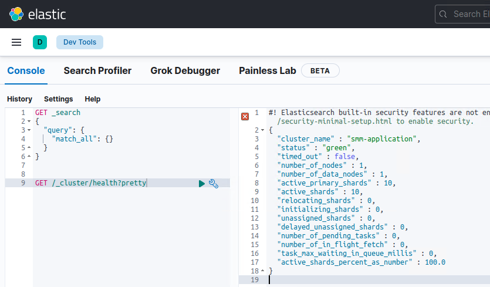
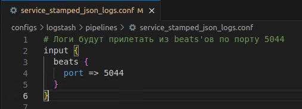

# Домашнее задание к занятию «ELK» - Михалёв Сергей

---

### Задание 1. Elasticsearch 

Установите и запустите Elasticsearch, после чего поменяйте параметр cluster_name на случайный. 

*Приведите скриншот команды 'curl -X GET 'localhost:9200/_cluster/health?pretty', сделанной на сервере с установленным Elasticsearch. Где будет виден нестандартный cluster_name*.

**Результат:**

- Скриншот с командой и результатом ее выполнения
  
  

---

### Задание 2. Kibana

Установите и запустите Kibana.

*Приведите скриншот интерфейса Kibana на странице http://<ip вашего сервера>:5601/app/dev_tools#/console, где будет выполнен запрос GET /_cluster/health?pretty*.

**Результат:**

- Скриншот интерфейса Kibana
  
  

---

### Задание 3. Logstash

Установите и запустите Logstash и Nginx. С помощью Logstash отправьте access-лог Nginx в Elasticsearch. 

*Приведите скриншот интерфейса Kibana, на котором видны логи Nginx.*

**Результат:**

- Скриншот настройки Logstash
  
  

- Скриншот интерфейса Kibana
  
  

---

### Задание 4. Filebeat. 

Установите и запустите Filebeat. Переключите поставку логов Nginx с Logstash на Filebeat. 

*Приведите скриншот интерфейса Kibana, на котором видны логи Nginx, которые были отправлены через Filebeat.*

**Результат:**

- Скриншот настройки Logstash
  
  

- Скриншот интерфейса Kibana
  
  

## Дополнительные задания (со звёздочкой*)
Эти задания дополнительные, то есть не обязательные к выполнению, и никак не повлияют на получение вами зачёта по этому домашнему заданию. Вы можете их выполнить, если хотите глубже шире разобраться в материале.

